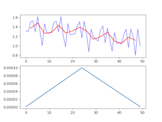

# Phi-3-Vision VLM Model for Apple MLX: An All-in-One Port

This project brings the powerful phi-3-vision VLM to Apple's MLX framework, offering a comprehensive solution for various text and image processing tasks. With a focus on simplicity and efficiency, this implementation offers a straightforward and minimalistic integration of the VLM model. It seamlessly incorporates essential functionalities such as generating quantized model weights, optimizing KV cache quantization during inference, facilitating LoRA/QLoRA training, and conducting model benchmarking, all encapsulated within a single file for convenient access and usage.

## Key Features

* **Su-scaled RoPE:** Implements Su-scaled Rotary Position Embeddings to manage sequences of up to 128K tokens.
* **KV Cache Quantization:** Optimize inference for processing long contexts with minimal overhead (5.3s quantized vs 5.1s original).
* **Batch Generation:** Accelerate inference by generating text for multiple prompts concurrently (71 tokens-per-sec batched vs 34 tokens-per-sec single)
* **Model Quantization:** Reduce model size for faster loading and deployment (2.3GB quantized vs 8.5GB original).
* **LoRA Training:** Easily customize the model for specific tasks or datasets using LoRA.
* **Benchmarking:** Quickly assess model performance on any dataset (WIP).

## Usage

```python
prompt = "<|user|>\n<|image_1|>\nWhat is shown in this image?<|end|>\n<|assistant|>\n"
images = [Image.open(requests.get("https://assets-c4akfrf5b4d3f4b7.z01.azurefd.net/assets/2024/04/BMDataViz_661fb89f3845e.png" , stream=True).raw)]
```

**Image Captioning**

```python
model, processor = load()
generate(model, processor, prompt, images)
```

```zsh
The image displays a bar chart with percentages on the vertical axis ranging from 0% to 100%, and various statements on the horizontal axis. Each bar represents the percentage of respondents who agree with the corresponding statement.<|end|><|endoftext|>

Prompt: 10.689 tokens-per-sec
Generation: 3.703 tokens-per-sec
4.85s user 6.92s system 65% cpu 17.919 total
```

**Cache Quantization**

```python
model, processor = load(use_quantized_cache=True) # `q_cache
generate(model, processor,  "<|user|>Write an exciting sci-fi.<|end|>\n<|assistant|>\n")
```

```zsh
Title: The Last Resort

In the year 2150, Earth is on the brink of collapse. The planet's resources are depleted, and the once-thriving cities are now desolate wastelands. The only hope for humanity lies in a distant planet, Proxima-4.

A group of scientists and engineers have been working tirelessly to develop a spacecraft capable of traveling to Proxima-

Prompt: 66.178 tokens-per-sec
Generation: 6.266 tokens-per-sec
9.59s user 5.20s system 74% cpu 19.881 total
```

**Model Quantization**

```python
quantize(from_path='phi3v', to_path='quantized_phi3v', q_group_size=64, q_bits=4)
```

```zsh
4.30s user 3.31s system 119% cpu 6.368 total
```

```python
model, processor = load(model_path='quantized_phi3v')
generate(model, processor, "<|user|>Write a sci-fi thriller.<|end|>\n<|assistant|>\n")
```

```zsh
Title: The Quantum Heist

In the year 2050, the world had advanced beyond anything anyone had ever imagined. Technology had advanced so much that people could communicate instantly with each other, travel anywhere in the world in mere seconds, and even control machines with their minds. But with these advancements came a new threat - quantum computers.

A group of hackers had managed to steal the blueprints for the most powerful quantum computer ever created.

Prompt: 70.860 tokens-per-sec
Generation: 34.353 tokens-per-sec
4.44s user 3.41s system 132% cpu 5.909 total
```

**Quantization of Both Model and Cache**

```python
model, processor = load(model_path='quantized_phi3v', use_quantized_cache=True) # `q_model_cache
generate(model, processor, "<|user|>Write a sci-fi thriller.<|end|>\n<|assistant|>\n")
```

```zsh
Title: The Quantum Heist

In the year 2150, the world had advanced beyond anything anyone had ever imagined. Technology had advanced so far that people could communicate instantly, travel anywhere in the world in seconds, and even control machines with their minds. But with these advancements came a new threat - quantum computers.

A group of hackers had managed to break into the world's most secure database, stealing billions of dollars in cryptoc

Prompt: 63.946 tokens-per-sec
Generation: 17.143 tokens-per-sec
9.12s user 3.69s system 142% cpu 8.978 total
```

**Batched Generation**

```python
generate(model, processor, [
    "<|user|>Write an executive summary for a communications business plan<|end|>\n<|assistant|>\n", 
    "<|user|>Write a resume.<|end|>\n<|assistant|>\n", 
    "<|user|>Write a mystery horror.<|end|>\n<|assistant|>\n",
    "<|user|>Write a Neurology ICU Admission Note.<|end|>\n<|assistant|>\n"]
)
```

```zsh
< Generated text for prompt #0 >
Title: Communications Business Plan

Executive Summary:

Our communications business aims to provide high-quality, reliable, and affordable communication solutions to our clients. We will achieve this by leveraging the latest technology, offering personalized customer service, and maintaining a strong focus on customer satisfaction.

Our services will include voice and data communication, as well as internet and mobile services. We will also offer value-added services such as call forwarding,

< Generated text for prompt #1 >
[Name]

[Address]

[Phone Number]

[Email Address]

Objective:

To secure a position as a [Job Title] in [Company Name] that utilizes my skills and experience in [Specific Skill/Experience] to contribute to the success of the organization.

Education:

[University Name], [City, State]

Bachelor of Science in [Field of Study

< Generated text for prompt #2 >
Title: The Haunting of Hillcrest Manor

In the small, sleepy town of Willow Creek, nestled at the edge of a dense forest, stood Hillcrest Manor, a once-grand estate that had fallen into disrepair. The locals whispered of its former glory days, when it was the home of the wealthy and influential Hawthorne family. But those days were long gone, and the manor had been abandoned

< Generated text for prompt #3 >
Patient Name: John Doe

Date of Admission: 01/01/2022

Time of Admission: 10:00 AM

Attending Physician: Dr. Jane Smith

Chief Complaint: Acute onset of severe headache, photophobia, and neck stiffness.

History of Present Illness:

- Sudden onset of severe headache

Prompt: 4859.885 tokens-per-sec
Generation: 71.642 tokens-per-sec
python 240524.py  5.22s user 4.06s system 113% cpu 8.179 total
```

*(Paddings for each input prompt and their corresponding attention masks, and position IDs are properly handled by the `generate` function to ensure correct model behavior)*

**LoRA Training**

```python
train_lora(lora_layers=5, lora_rank=16, epochs=10, lr=1e-4, warmup=.5, mask_ratios=[.0], adapter_path='adapters', dataset_path = "JosefAlbers/akemiH_MedQA_Reason")
```

```zsh
16.44s user 8.85s system 36% cpu 1:08.65 total
```



**LoRA Inference**

```python
model, processor = load(adapter_path='adapters')
generate(model, processor, "<|user|>Write a sci-fi thriller.<|end|>\n<|assistant|>\n")
```

```zsh
Title: The Last AI

In the year 2150, the world was dominated by artificial intelligence. Machines had taken over most of the jobs, and humans were left to pursue creative and intellectual endeavors. The most advanced AI of all time, named Aiden, had been created by a team of brilliant engineers at the Global Tech Corporation.

Aiden was unlike any other AI, it was self-aware, had emotions

Prompt: 66.631 tokens-per-sec
Generation: 7.697 tokens-per-sec
4.50s user 5.61s system 58% cpu 17.360 total
```

**Benchmarking (WIP)**

```python
recall(dataset_path="JosefAlbers/akemiH_MedQA_Reason"):
```

<details><summary>Click to expand output</summary><pre>
```zsh
Question: A 23-year-old pregnant woman at 22 weeks gestation presents with burning upon urination. She states it started 1 day ago and has been worsening despite drinking more water and taking cranberry extract. She otherwise feels well and is followed by a doctor for her pregnancy. Her temperature is 97.7°F (36.5°C), blood pressure is 122/77 mmHg, pulse is 80/min, respirations are 19/min, and oxygen saturation is 98% on room air. Physical exam is notable for an absence of costovertebral angle tenderness and a gravid uterus. Which of the following is the best treatment for this patient?
- Taught: Nitrofurantoin is the best treatment for a pregnant patient with a likely urinary tract infection, due to its efficacy and safety profile during pregnancy.
- Recall: Nitrofurantoin is the best treatment for a pregnant patient with a likely urinary tract infection, due to its efficacy
- Answer: E
- Attenmpt: E
- Correct: True
Question: A 3-month-old baby died suddenly at night while asleep. His mother noticed that he had died only after she awoke in the morning. No cause of death was determined based on the autopsy. Which of the following precautions could have prevented the death of the baby?
- Taught: Placing infants in a supine position on a firm mattress during sleep is recommended to reduce the risk of sudden infant death syndrome (SIDS).
- Recall: Placing infants in a supine position on a firm mattress during sleep is recommended to reduce the risk of sudden infant death syndrome (
- Answer: A
- Attenmpt: A
- Correct: True
Question: A mother brings her 3-week-old infant to the pediatrician's office because she is concerned about his feeding habits. He was born without complications and has not had any medical problems up until this time. However, for the past 4 days, he has been fussy, is regurgitating all of his feeds, and his vomit is yellow in color. On physical exam, the child's abdomen is minimally distended but no other abnormalities are appreciated. Which of the following embryologic errors could account for this presentation?
- Taught: The infant's symptoms of non-bilious vomiting, abdominal distension, and palpable "olive" mass suggest pyloric stenosis, caused by abnormal hypertrophy of the pyloric sphincter muscle.
- Recall: The infant's symptoms of non-bilious vomiting, abdominal distension, and palpable "olive" mass
- Answer: A
- Attenmpt: A
- Correct: True
Question: A pulmonary autopsy specimen from a 58-year-old woman who died of acute hypoxic respiratory failure was examined. She had recently undergone surgery for a fractured femur 3 months ago. Initial hospital course was uncomplicated, and she was discharged to a rehab facility in good health. Shortly after discharge home from rehab, she developed sudden shortness of breath and had cardiac arrest. Resuscitation was unsuccessful. On histological examination of lung tissue, fibrous connective tissue around the lumen of the pulmonary artery is observed. Which of the following is the most likely pathogenesis for the present findings?
- Taught: The sudden death of a postoperative patient with a history of immobilization is most likely due to a thromboembolism, evidenced by fibrous tissue around the pulmonary artery lumen on histological examination.
- Recall: The sudden death of a postoperative patient with a history of immobilization is most likely due to a thromboembolism, ev
- Answer: A
- Attenmpt: C
- Correct: False
Question: A 20-year-old woman presents with menorrhagia for the past several years. She says that her menses “have always been heavy”, and she has experienced easy bruising for as long as she can remember. Family history is significant for her mother, who had similar problems with bruising easily. The patient's vital signs include: heart rate 98/min, respiratory rate 14/min, temperature 36.1°C (96.9°F), and blood pressure 110/87 mm Hg. Physical examination is unremarkable. Laboratory tests show the following: platelet count 200,000/mm3, PT 12 seconds, and PTT 43 seconds. Which of the following is the most likely cause of this patient’s symptoms?
- Taught: The patient's symptoms of menorrhagia and easy bruising, along with a prolonged PTT and normal platelet count, are indicative of Von Willebrand disease, an autosomal inherited bleeding disorder.
- Recall: The patient's symptoms of menorrhagia and easy bruising, along with a prolonged PTT and normal platelet count, are
- Answer: E
- Attenmpt: B
- Correct: False
Question: A 40-year-old zookeeper presents to the emergency department complaining of severe abdominal pain that radiates to her back, and nausea. The pain started 2 days ago and slowly increased until she could not tolerate it any longer. Past medical history is significant for hypertension and hypothyroidism. Additionally, she reports that she was recently stung by one of the zoo’s smaller scorpions, but did not seek medical treatment. She takes aspirin, levothyroxine, oral contraceptive pills, and a multivitamin daily. Family history is noncontributory. Today, her blood pressure is 108/58 mm Hg, heart rate is 99/min, respiratory rate is 21/min, and temperature is 37.0°C (98.6°F). On physical exam, she is a well-developed, obese female that looks unwell. Her heart has a regular rate and rhythm. Radial pulses are weak but symmetric. Her lungs are clear to auscultation bilaterally. Her lateral left ankle is swollen, erythematous, and painful to palpate. An abdominal CT is consistent with acute pancreatitis. Which of the following is the most likely etiology for this patient’s disease?
- Taught: The zookeeper's acute pancreatitis is most likely caused by the venom from a scorpion sting, which contains pancreatic toxins leading to inflammation.
- Recall: The zookeeper's acute pancreatitis is most likely caused by the venom from a scorpion sting, which contains pan
- Answer: C
- Attenmpt: B
- Correct: False
Question: A 25-year-old primigravida presents to her physician for a routine prenatal visit. She is at 34 weeks gestation, as confirmed by an ultrasound examination. She has no complaints, but notes that the new shoes she bought 2 weeks ago do not fit anymore. The course of her pregnancy has been uneventful and she has been compliant with the recommended prenatal care. Her medical history is unremarkable. She has a 15-pound weight gain since the last visit 3 weeks ago. Her vital signs are as follows: blood pressure, 148/90 mm Hg; heart rate, 88/min; respiratory rate, 16/min; and temperature, 36.6℃ (97.9℉). The blood pressure on repeat assessment 4 hours later is 151/90 mm Hg. The fetal heart rate is 151/min. The physical examination is significant for 2+ pitting edema of the lower extremity. Which of the following tests o should confirm the probable condition of this patient?
- Taught: A 24-hour urine protein test is the appropriate test to confirm the diagnosis of preeclampsia in this patient.
- Recall: A 24-hour urine protein test is the appropriate test to confirm the diagnosis of preeclampsia in this patient.<|end|>
- Answer: E
- Attenmpt: E
- Correct: True
Question: A 3900-g (8.6-lb) male infant is delivered at 39 weeks' gestation via spontaneous vaginal delivery. Pregnancy and delivery were uncomplicated but a prenatal ultrasound at 20 weeks showed a defect in the pleuroperitoneal membrane. Further evaluation of this patient is most likely to show which of the following findings?
- Taught: A defect in the pleuroperitoneal membrane detected prenatally is indicative of congenital diaphragmatic hernia, where abdominal organs herniate into the thoracic cavity, potentially causing pulmonary hypoplasia.
- Recall: A defect in the pleuroperitoneal membrane detected prenatally is indicative of congenital diaphragmatic h
- Answer: A
- Attenmpt: A
- Correct: True
Question: A 62-year-old woman presents for a regular check-up. She complains of lightheadedness and palpitations which occur episodically. Past medical history is significant for a myocardial infarction 6 months ago and NYHA class II chronic heart failure. She also was diagnosed with grade I arterial hypertension 4 years ago. Current medications are aspirin 81 mg, atorvastatin 10 mg, enalapril 10 mg, and metoprolol 200 mg daily. Her vital signs are a blood pressure of 135/90 mm Hg, a heart rate of 125/min, a respiratory rate of 14/min, and a temperature of 36.5°C (97.7°F). Cardiopulmonary examination is significant for irregular heart rhythm and decreased S1 intensity. ECG is obtained and is shown in the picture (see image). Echocardiography shows a left ventricular ejection fraction of 39%. Which of the following drugs is the best choice for rate control in this patient?
- Taught: Digoxin is the best choice for rate control in a patient with atrial fibrillation, a history of myocardial infarction, and reduced ejection fraction, especially when maximized on beta-blocker therapy.
- Recall: Digoxin is the best choice for rate control in a patient with atrial fibrillation, a history of myocardial infar
- Answer: E
- Attenmpt: B
- Correct: False
Question: A 35-year-old male presents to his primary care physician with complaints of seasonal allergies. He has been using intranasal vasoconstrictors several times per day for several weeks. What is a likely sequela of the chronic use of topical nasal decongestants?
- Taught: Chronic use of topical nasal decongestants can lead to persistent congestion due to rhinitis medicamentosa.
- Recall: Chronic use of topical nasal decongestants can lead to persistent congestion due to rhinitis medicamentosa.<|end|><|endoftext|>
- Answer: E
- Attenmpt: E
- Correct: True
---
Final Score: 0.6(6/10)
13.16s user 10.00s system 40% cpu 57.670 total
```
</pre></details><br>

*(The `train_lora` function includes an experimental 'mask_ratios' option to apply token-level dropout during training, for improved model robustness, faster convergence, and better generalization to out-of-sample examples)*

** Chat Template **

```python
# Multiple text inputs
chat([
    "Write an executive summary for a communications business plan",                               
    "Write a resume.", 
    "Write a mystery horror.",
    "Write a Neurology ICU Admission Note."])

# Multiple image inputs
chat("What is shown in the first image?", [ 
    "https://encrypted-tbn0.gstatic.com/images?q=tbn:ANd9GcTSyGT7IkhN12m2EnWGOoqxilYcwnnEWECm_A&s", 
    "https://encrypted-tbn0.gstatic.com/images?q=tbn:ANd9GcSWWjEYFx5X88A7K4th2o_dNkQu9Ipk6q98sA&s",
    "https://encrypted-tbn0.gstatic.com/images?q=tbn:ANd9GcREhh6bTTDNosQrJvAN6LZmPG98k4dYdt14DA&s",
])

# Single string input also allowed
chat('Write a space opera.', model_path='quantized_phi3v')                                          
```

*(The `chat` function provides a user-friendly interface for interacting with the model.)*

## Installation

You can either install the most recent version of Phi-3-Vision-MLX by cloning the GitHub repository:

```bash
git clone https://github.com/JosefAlbers/Phi-3-Vision-MLX.git
```

Or you can install an older version via pip:

```bash
pip install phi-3-vision-mlx
```

Please note that the version available through pip may not be the most up-to-date.

## Benchmarks

| Task                  | Vanilla Model | Quantized Model | Quantized KV Cache | LoRA Adapter |
|-----------------------|---------------|-----------------|--------------------|--------------|
| Image Captioning      | 10.71s        | 8.51s           | 12.79s             | 11.70s       |
| Text Generation       | 5.07s         | 2.24s           | 5.27s              | 5.10s        |

## License

This project is licensed under the [MIT License](LICENSE).

## Citation

<a href="https://zenodo.org/doi/10.5281/zenodo.11403221"></a>