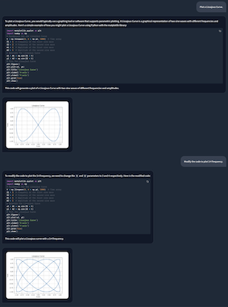
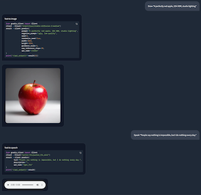

# Phi-3-Vision for Apple MLX

Phi-3-Vision for Apple MLX is a powerful and flexible AI agent framework that leverages the Phi-3-Vision model to perform a wide range of tasks, from visual question answering to code generation and execution. This project aims to provide an easy-to-use interface for interacting with the Phi-3-Vision model, while also offering advanced features like custom toolchains and model quantization.

Phi-3-Vision is a state-of-the-art vision-language model that excels in understanding and generating content based on both textual and visual inputs. By integrating this model with Apple's MLX framework, we provide a high-performance solution optimized for Apple silicon.

## Quick Start

**1. Install Phi-3 Vision MLX:**

To install Phi-3-Vision-MLX, run the following command:

```bash
pip install phi-3-vision-mlx
```

**2. Launch Phi-3 Vision MLX:**

To launch Phi-3-Vision-MLX:

```bash
phi3v
```

Or in a Python script:

```python
from phi_3_vision_mlx import Agent

agent = Agent()
```

## Usage

### **Visual Question Answering (VQA)**

```python
agent('What is shown in this image?', 'https://collectionapi.metmuseum.org/api/collection/v1/iiif/344291/725918/main-image')
agent.end()
```


### **Generative Feedback Loop**

The agent can be used to generate code, execute it, and then modify it based on feedback:

```python
agent('Plot a Lissajous Curve.')
agent('Modify the code to plot 3:4 frequency')
agent.end()
```



### **API Tool Use**

You can use the agent to create images or generate speech using API calls:

```python
agent('Draw "A perfectly red apple, 32k HDR, studio lighting"')
agent.end()
agent('Speak "People say nothing is impossible, but I do nothing every day."')
agent.end()
```



### **Custom Toolchain**

Toolchains allow you to customize the agent's behavior for specific tasks. Here are three examples:

#### Example 1: In-Context Learning (ICL)

You can create a custom toolchain to add context to the prompt:

```python
from phi_3_vision_mlx import load_text

# Create tool
def add_text(prompt):
    prompt, path = prompt.split('@')
    return f'{load_text(path)}\n<|end|>\n<|user|>{prompt}'

# Chain tools
toolchain = """
    prompt = add_text(prompt)
    responses = generate(prompt, images)
    """

# Create agent
agent = Agent(toolchain, early_stop=100)

# Run agent
agent('How to inspect API endpoints? @https://raw.githubusercontent.com/gradio-app/gradio/main/guides/08_gradio-clients-and-lite/01_getting-started-with-the-python-client.md')
```

This toolchain adds context to the prompt from an external source, enhancing the agent's knowledge for specific queries.

#### Example 2: Retrieval Augmented Generation (RAG)

You can create another custom toolchain for retrieval-augmented generation (RAG) to code:

```python
from phi_3_vision_mlx import VDB
import datasets

# User proxy
user_input = 'Comparison of Sortino Ratio for Bitcoin and Ethereum.'

# Create tool
def rag(prompt, repo_id="JosefAlbers/sharegpt_python_mlx", n_topk=1):
    ds = datasets.load_dataset(repo_id, split='train')
    vdb = VDB(ds)
    context = vdb(prompt, n_topk)[0][0]
    return f'{context}\n<|end|>\n<|user|>Plot: {prompt}'

# Chain tools
toolchain_plot = """
    prompt = rag(prompt)
    responses = generate(prompt, images)
    files = execute(responses, step)
    """

# Create agent
agent = Agent(toolchain_plot, False)

# Run agent
_, images = agent(user_input)
```

#### Example 3: Multi-Agent Interaction

You can also have multiple agents interacting to complete a task:

```python
agent_writer = Agent(early_stop=100)
agent_writer(f'Write a stock analysis report on: {user_input}', images)
```

### **Batch Generation**

For efficient processing of multiple prompts:

```python
from phi_3_vision_mlx import generate

generate([
    "Write an executive summary for a communications business plan",
    "Write a resume.", 
    "Write a mystery horror.",
    "Write a Neurology ICU Admission Note.",])
```

### **Model and Cache Quantization**

Quantization can significantly reduce model size and improve inference speed:

```python
generate("Write a cosmic horror.", quantize_cache=True)
generate("Write a cosmic horror.", quantize_model=True)
```

### **LoRA Training and Inference**

Fine-tune the model for specific tasks:

```python
from phi_3_vision_mlx import train_lora

train_lora(lora_layers=5, lora_rank=16, epochs=10, lr=1e-4, warmup=.5, mask_ratios=[.0], adapter_path='adapters', dataset_path = "JosefAlbers/akemiH_MedQA_Reason")
```


Use the fine-tuned model:

```python
generate("Write a cosmic horror.", adapter_path='adapters')
```

## Benchmarks

| Task                  | Vanilla Model | Quantized Model | Quantized Cache | LoRA        |
|-----------------------|---------------|-----------------|-----------------|-------------|
| Text Generation       |  8.72 tps     |  55.97 tps       |  7.04 tps      |  8.71 tps   |
| Image Captioning      |  8.04 tps     |  32.48 tps       |  1.77 tps      |  8.00 tps   |
| Batched Generation    | 30.74 tps     | 106.94 tps       | 20.47 tps      | 30.72 tps   |

## License

This project is licensed under the [MIT License](LICENSE).

## Citation

<a href="https://zenodo.org/doi/10.5281/zenodo.11403221"></a>
