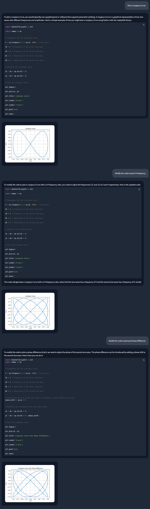
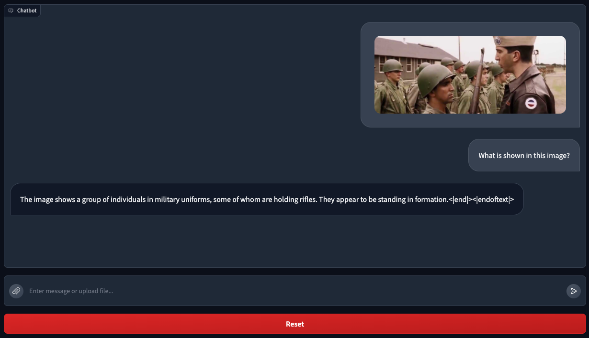

# Phi-3-Vision VLM Model for Apple MLX: An All-in-One Port

This project brings the powerful phi-3-vision VLM to Apple's MLX framework, offering a comprehensive solution for various text and image processing tasks. With a focus on simplicity and efficiency, this implementation offers a straightforward and minimalistic integration of the VLM model. It seamlessly incorporates essential functionalities such as generating quantized model weights, optimizing KV cache quantization during inference, facilitating LoRA/QLoRA training, and conducting model benchmarking, all encapsulated within a single file for convenient access and usage.

## Key Features

* **VLM Agent:** Leverages VLM's visual understanding for interactive code generation and refinement, enabling data visualization and image manipulation through a visual feedback loop. (WIP)
* **Batch Generation:** Accelerate inference by generating text for multiple prompts concurrently (107 tokens-per-sec batched vs 56 tokens-per-sec original)
* **Cache Quantization:** Optimize inference for processing long contexts with key-value cache quantization (5.3s quantized vs 5.1s original).
* **Model Quantization:** Reduce model size for faster loading and deployment (2.3GB quantized vs 8.5GB original).
* **Su-scaled RoPE:** Implements Su-scaled Rotary Position Embeddings to manage sequences of up to 128K tokens.
* **Chat Template:** Utilization of chat template for streamlining interactions with the model.
* **LoRA Training:** Easily customize the model for specific tasks or datasets using LoRA.
* **Benchmarking:** To quickly assess model performance on any dataset. (WIP)
* **Long Context RAG:** Enables the integration of Retrieval-Augmented Generation to harness large amounts of external knowledge for complex tasks such as code understanding, leveraging the phi-3-vision model's 128K context window. (WIP)

## Quick Start

### **VLM Agent** (WIP)

VLM's understanding of both text and visuals enables interactive generation and modification of plots/images, opening up new possibilities for GUI development and data visualization.

```python
# from phi_3_vision_mlx import chatui

chatui()
```





### **Image Captioning**

```python
# from phi_3_vision_mlx import chat

chat('What is shown in this image?', 'https://assets-c4akfrf5b4d3f4b7.z01.azurefd.net/assets/2024/04/BMDataViz_661fb89f3845e.png')
```

<details><summary>Click to expand output</summary><pre>
The image displays a bar chart with percentages on the vertical axis ranging from 0% to 100%, and various statements on the horizontal axis. Each bar represents the percentage of respondents who agree with the corresponding statement. The statements include 'Having clear goals for a meeting', 'Knowing where to find information', 'Having more focus on summarization', 'Understand information I need', 'Having tools to prepare for meetings', and 'Having clear

Prompt: 377.97 tokens-per-sec (3103 tokens / 8.2 sec)
Generation: 8.04 tokens-per-sec (100 tokens / 12.3 sec)
</pre></details><br>

### **Batched Generation**

Paddings for each input prompt and their corresponding attention masks, and position IDs are properly handled by the `generate` function to ensure correct model behavior.

```python
chat([
    "Write an executive summary for a communications business plan",
    "Write a resume.", 
    "Write a mystery horror.",
    "Write a Neurology ICU Admission Note.",])
```

<details><summary>Click to expand output</summary><pre>
< Generated text for prompt #0 >
Title: Communications Business Plan

Executive Summary:

Our communications business plan aims to establish a leading provider of communication solutions for businesses and individuals. We will focus on delivering high-quality, reliable, and cost-effective communication services, including voice, video, and data services. Our services will be tailored to meet the unique needs of our customers, and we will offer a range of packages and plans to suit different budgets and requirements.


< Generated text for prompt #1 >
Title: [Your Name]

Contact Information:

Email: [Your Email]
Phone: [Your Phone]

Objective:

To obtain a position as a [Your Desired Position] in [Your Industry/Company] that utilizes my skills and experience to contribute to the success of the organization.

Education:

[Your Name]
[Your Degree]
[Your Major]
[Your University]
[Year

< Generated text for prompt #2 >
Title: The Haunting of Hillcrest Manor

In the small, sleepy town of Crestwood, nestled at the edge of a dense forest, stood an imposing manor known as Hillcrest Manor. The manor had been abandoned for decades, its once grand facade now crumbling and overgrown with ivy. Whispers of its dark past and the mysterious disappearance of its former inhabitants had become the stuff of local

< Generated text for prompt #3 >
Neurology ICU Admission Note

Patient: John Doe

Date: [Insert Date]

Time: [Insert Time]

Chief Complaint: Severe headache, nausea, and vomiting

History of Present Illness: The patient presented to the emergency department with a severe headache, nausea, and vomiting. The headache was described as a constant, throbbing pain that was worse

Prompt: 134.22 tokens-per-sec (80 tokens / 0.6 sec)
Generation: 30.74 tokens-per-sec (400 tokens / 13.0 sec)
</pre></details><br>

### **Cache Quantization**

```python
chat("Write a cosmic horror.", quantize_cache=True)
```

<details><summary>Click to expand output</summary><pre>
Title: The Echoes of the Void

In the depths of the cosmic abyss, where the stars are but distant memories and the black hole's pull is a relentless force, there exists a realm of unimaginable horror. This is the realm of The Echoes of the Void, a place where the very fabric of reality is distorted and the line between the living and the dead is blurred.

The Echo

Prompt: 45.88 tokens-per-sec (14 tokens / 0.3 sec)
Generation: 6.82 tokens-per-sec (100 tokens / 14.5 sec)
</pre></details><br>

### **Model Quantization**

```python
chat("Write a cosmic horror.", quantize_model=True)
```

<details><summary>Click to expand output</summary><pre>
Title: The Eye of the Void

The night was dark and cold, and the stars shone brightly in the sky above. The wind howled through the trees, carrying with it the scent of death and decay.

In the heart of the forest, a lone figure stood, staring into the abyss. His name was John, and he had been drawn to this place by a mysterious force that he could not explain.

As he stood there

Prompt: 149.99 tokens-per-sec (14 tokens / 0.1 sec)
Generation: 53.36 tokens-per-sec (100 tokens / 1.9 sec)
</pre></details><br>

### **LoRA Training**

```python
# from phi_3_vision_mlx import train_lora

train_lora(lora_layers=5, lora_rank=16, epochs=10, lr=1e-4, warmup=.5, mask_ratios=[.0], adapter_path='adapters', dataset_path = "JosefAlbers/akemiH_MedQA_Reason")
```


### **LoRA Inference**

```python
chat("Write a cosmic horror.", adapter_path='adapters')
```

<details><summary>Click to expand output</summary><pre>
Title: The Echoes of the Void

In the depths of the cosmic abyss, where the stars are but distant memories and the black hole's pull is a relentless force, there exists a realm of unimaginable horror. This is the realm of The Echoes of the Void, a place where the very fabric of reality is distorted and the line between life and death is blurred.

The Echoes of

Prompt: 36.87 tokens-per-sec (14 tokens / 0.4 sec)
Generation: 8.56 tokens-per-sec (100 tokens / 11.6 sec)
</pre></details><br>

### **LoRA Testing** (WIP)

```python
# from phi_3_vision_mlx import recall

test_lora(dataset_path="JosefAlbers/akemiH_MedQA_Reason"):
```

<details><summary>Click to expand output</summary><pre>
Question: A 23-year-old pregnant woman at 22 weeks gestation presents with burning upon urination. She states it started 1 day ago and has been worsening despite drinking more water and taking cranberry extract. She otherwise feels well and is followed by a doctor for her pregnancy. Her temperature is 97.7°F (36.5°C), blood pressure is 122/77 mmHg, pulse is 80/min, respirations are 19/min, and oxygen saturation is 98% on room air. Physical exam is notable for an absence of costovertebral angle tenderness and a gravid uterus. Which of the following is the best treatment for this patient?
- Taught: Nitrofurantoin is the best treatment for a pregnant patient with a likely urinary tract infection, due to its efficacy and safety profile during pregnancy.
- Recall: Nitrofurantoin is the best treatment for a pregnant patient with a likely urinary tract infection, due to its efficacy
- Answer: E
- Attenmpt: E
- Correct: True
Question: A 3-month-old baby died suddenly at night while asleep. His mother noticed that he had died only after she awoke in the morning. No cause of death was determined based on the autopsy. Which of the following precautions could have prevented the death of the baby?
- Taught: Placing infants in a supine position on a firm mattress during sleep is recommended to reduce the risk of sudden infant death syndrome (SIDS).
- Recall: Placing infants in a supine position on a firm mattress during sleep is recommended to reduce the risk of sudden infant death syndrome (
- Answer: A
- Attenmpt: A
- Correct: True
Question: A mother brings her 3-week-old infant to the pediatrician's office because she is concerned about his feeding habits. He was born without complications and has not had any medical problems up until this time. However, for the past 4 days, he has been fussy, is regurgitating all of his feeds, and his vomit is yellow in color. On physical exam, the child's abdomen is minimally distended but no other abnormalities are appreciated. Which of the following embryologic errors could account for this presentation?
- Taught: The infant's symptoms of non-bilious vomiting, abdominal distension, and palpable "olive" mass suggest pyloric stenosis, caused by abnormal hypertrophy of the pyloric sphincter muscle.
- Recall: The infant's symptoms of non-bilious vomiting, abdominal distension, and palpable "olive" mass
- Answer: A
- Attenmpt: A
- Correct: True
Question: A pulmonary autopsy specimen from a 58-year-old woman who died of acute hypoxic respiratory failure was examined. She had recently undergone surgery for a fractured femur 3 months ago. Initial hospital course was uncomplicated, and she was discharged to a rehab facility in good health. Shortly after discharge home from rehab, she developed sudden shortness of breath and had cardiac arrest. Resuscitation was unsuccessful. On histological examination of lung tissue, fibrous connective tissue around the lumen of the pulmonary artery is observed. Which of the following is the most likely pathogenesis for the present findings?
- Taught: The sudden death of a postoperative patient with a history of immobilization is most likely due to a thromboembolism, evidenced by fibrous tissue around the pulmonary artery lumen on histological examination.
- Recall: The sudden death of a postoperative patient with a history of immobilization is most likely due to a thromboembolism, ev
- Answer: A
- Attenmpt: C
- Correct: False
Question: A 20-year-old woman presents with menorrhagia for the past several years. She says that her menses “have always been heavy”, and she has experienced easy bruising for as long as she can remember. Family history is significant for her mother, who had similar problems with bruising easily. The patient's vital signs include: heart rate 98/min, respiratory rate 14/min, temperature 36.1°C (96.9°F), and blood pressure 110/87 mm Hg. Physical examination is unremarkable. Laboratory tests show the following: platelet count 200,000/mm3, PT 12 seconds, and PTT 43 seconds. Which of the following is the most likely cause of this patient’s symptoms?
- Taught: The patient's symptoms of menorrhagia and easy bruising, along with a prolonged PTT and normal platelet count, are indicative of Von Willebrand disease, an autosomal inherited bleeding disorder.
- Recall: The patient's symptoms of menorrhagia and easy bruising, along with a prolonged PTT and normal platelet count, are
- Answer: E
- Attenmpt: B
- Correct: False
Question: A 40-year-old zookeeper presents to the emergency department complaining of severe abdominal pain that radiates to her back, and nausea. The pain started 2 days ago and slowly increased until she could not tolerate it any longer. Past medical history is significant for hypertension and hypothyroidism. Additionally, she reports that she was recently stung by one of the zoo’s smaller scorpions, but did not seek medical treatment. She takes aspirin, levothyroxine, oral contraceptive pills, and a multivitamin daily. Family history is noncontributory. Today, her blood pressure is 108/58 mm Hg, heart rate is 99/min, respiratory rate is 21/min, and temperature is 37.0°C (98.6°F). On physical exam, she is a well-developed, obese female that looks unwell. Her heart has a regular rate and rhythm. Radial pulses are weak but symmetric. Her lungs are clear to auscultation bilaterally. Her lateral left ankle is swollen, erythematous, and painful to palpate. An abdominal CT is consistent with acute pancreatitis. Which of the following is the most likely etiology for this patient’s disease?
- Taught: The zookeeper's acute pancreatitis is most likely caused by the venom from a scorpion sting, which contains pancreatic toxins leading to inflammation.
- Recall: The zookeeper's acute pancreatitis is most likely caused by the venom from a scorpion sting, which contains pan
- Answer: C
- Attenmpt: B
- Correct: False
Question: A 25-year-old primigravida presents to her physician for a routine prenatal visit. She is at 34 weeks gestation, as confirmed by an ultrasound examination. She has no complaints, but notes that the new shoes she bought 2 weeks ago do not fit anymore. The course of her pregnancy has been uneventful and she has been compliant with the recommended prenatal care. Her medical history is unremarkable. She has a 15-pound weight gain since the last visit 3 weeks ago. Her vital signs are as follows: blood pressure, 148/90 mm Hg; heart rate, 88/min; respiratory rate, 16/min; and temperature, 36.6℃ (97.9℉). The blood pressure on repeat assessment 4 hours later is 151/90 mm Hg. The fetal heart rate is 151/min. The physical examination is significant for 2+ pitting edema of the lower extremity. Which of the following tests o should confirm the probable condition of this patient?
- Taught: A 24-hour urine protein test is the appropriate test to confirm the diagnosis of preeclampsia in this patient.
- Recall: A 24-hour urine protein test is the appropriate test to confirm the diagnosis of preeclampsia in this patient.<|end|>
- Answer: E
- Attenmpt: E
- Correct: True
Question: A 3900-g (8.6-lb) male infant is delivered at 39 weeks' gestation via spontaneous vaginal delivery. Pregnancy and delivery were uncomplicated but a prenatal ultrasound at 20 weeks showed a defect in the pleuroperitoneal membrane. Further evaluation of this patient is most likely to show which of the following findings?
- Taught: A defect in the pleuroperitoneal membrane detected prenatally is indicative of congenital diaphragmatic hernia, where abdominal organs herniate into the thoracic cavity, potentially causing pulmonary hypoplasia.
- Recall: A defect in the pleuroperitoneal membrane detected prenatally is indicative of congenital diaphragmatic h
- Answer: A
- Attenmpt: A
- Correct: True
Question: A 62-year-old woman presents for a regular check-up. She complains of lightheadedness and palpitations which occur episodically. Past medical history is significant for a myocardial infarction 6 months ago and NYHA class II chronic heart failure. She also was diagnosed with grade I arterial hypertension 4 years ago. Current medications are aspirin 81 mg, atorvastatin 10 mg, enalapril 10 mg, and metoprolol 200 mg daily. Her vital signs are a blood pressure of 135/90 mm Hg, a heart rate of 125/min, a respiratory rate of 14/min, and a temperature of 36.5°C (97.7°F). Cardiopulmonary examination is significant for irregular heart rhythm and decreased S1 intensity. ECG is obtained and is shown in the picture (see image). Echocardiography shows a left ventricular ejection fraction of 39%. Which of the following drugs is the best choice for rate control in this patient?
- Taught: Digoxin is the best choice for rate control in a patient with atrial fibrillation, a history of myocardial infarction, and reduced ejection fraction, especially when maximized on beta-blocker therapy.
- Recall: Digoxin is the best choice for rate control in a patient with atrial fibrillation, a history of myocardial infar
- Answer: E
- Attenmpt: B
- Correct: False
Question: A 35-year-old male presents to his primary care physician with complaints of seasonal allergies. He has been using intranasal vasoconstrictors several times per day for several weeks. What is a likely sequela of the chronic use of topical nasal decongestants?
- Taught: Chronic use of topical nasal decongestants can lead to persistent congestion due to rhinitis medicamentosa.
- Recall: Chronic use of topical nasal decongestants can lead to persistent congestion due to rhinitis medicamentosa.<|end|><|endoftext|>
- Answer: E
- Attenmpt: E
- Correct: True
---
Final Score: 0.6(6/10)
13.16s user 10.00s system 40% cpu 57.670 total
</pre></details><br>

### **Long Context RAG** (WIP)

This code demonstrates a Retrieval-Augmented Generation (RAG) workflow by fetching documentations and source codes from GitHub repositories, consolidating them into an 11,135 token prompt, and feeding it into a language model. Leveraging the 128K context window, the model then utilizes the retrieved information to provide an explanation of the codes contained in the target repository.

```python
# from phi_3_vision_mlx import _load_text

context = _load_text("https://raw.githubusercontent.com/ml-explore/mlx/main/docs/src", ["index.rst", "usage/quick_start.rst", "examples/mlp.rst", "examples/llama-inference.rst"])
gh_code = _load_text("https://raw.githubusercontent.com/vegaluisjose/mlx-rag/main", ["model.py", "vdb.py",], True)
prompt = '{context}\n<|end|>\n<|user|>Explain the folowing codes.\n\n{gh_code}\n'.format(context=context, gh_code=gh_code)
chat(prompt, max_tokens=1000)
```

<details><summary>Click to expand output</summary><pre>
The provided code is a Python implementation of a vector database (VDB) using the MLX framework. The VDB is designed to store and retrieve text data in a vectorized format, allowing for efficient similarity search and retrieval. The code includes several classes and functions to handle the various aspects of the VDB, such as loading and saving the model, ingesting text data, querying the database, and saving the database to disk.

The `Model` class is the main class that handles the vector database operations. It loads the model from a pre-trained embedding model and initializes the necessary components, such as the embeddings and the encoder. The `run` method is used to run the model on a given input text and returns the embeddings. The `savez` method is used to save the model to disk.

The `BertEmbeddings` class is a subclass of `nn.Module` that represents the BERT embeddings used for the VDB. It includes methods for initializing the embeddings and computing the embeddings for a given input text.

The `Bert` class is another subclass of `nn.Module` that represents the BERT model used for the VDB. It includes methods for running the model on a given input text and returning the embeddings.

The `Model` class is a wrapper class that uses the `Bert` class to create a vector database. It loads the model from a pre-trained embedding model and initializes the necessary components. The `ingest` method is used to ingest text data into the VDB. The `query` method is used to query the VDB for similar text based on a given input text.

The `VectorDB` class is a wrapper class that uses the `Model` class to create a vector database. It loads the model from a pre-trained embedding model and initializes the necessary components. The `ingest` method is used to ingest text data into the VDB. The `savez` method is used to save the VDB to disk.


Prompt: 284.76 tokens-per-sec (11135 tokens / 39.1 sec)
Generation: 6.22 tokens-per-sec (444 tokens / 71.2 sec)
</pre></details><br>

## Installation

You can either install the most recent version of Phi-3-Vision-MLX by cloning the GitHub repository:

```bash
git clone https://github.com/JosefAlbers/Phi-3-Vision-MLX.git
```

Or you can install an older version via pip:

```bash
pip install phi-3-vision-mlx
```

Please note that the version available through pip may not be the most up-to-date.

## Benchmarks

| Task                  | Vanilla Model | Quantized Model | Quantized Cache | LoRA        |
|-----------------------|---------------|-----------------|-----------------|-------------|
| Text Generation       |  8.72 tps     |  55.97 tps       |  7.04 tps      |  8.71 tps   |
| Image Captioning      |  8.04 tps     |  32.48 tps       |  1.77 tps      |  8.00 tps   |
| Batched Generation    | 30.74 tps     | 106.94 tps       | 20.47 tps      | 30.72 tps   |

## License

This project is licensed under the [MIT License](LICENSE).

## Citation

<a href="https://zenodo.org/doi/10.5281/zenodo.11403221"></a>